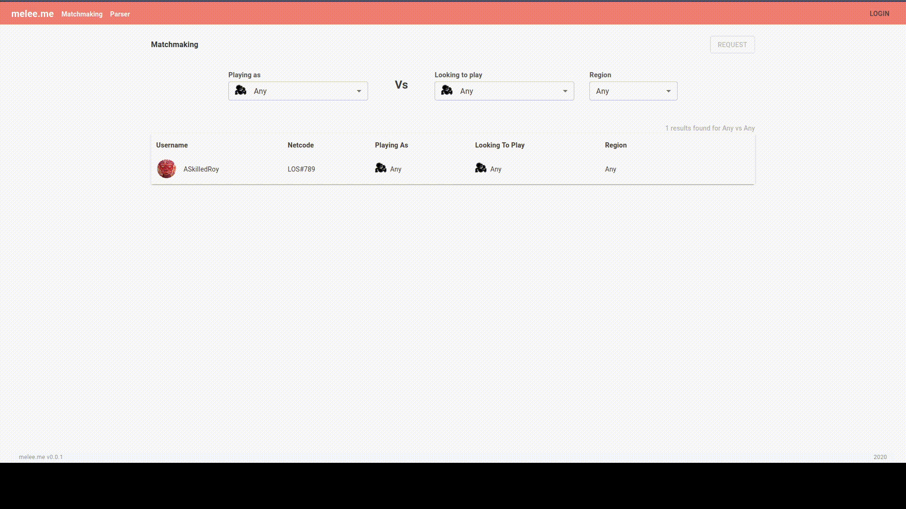
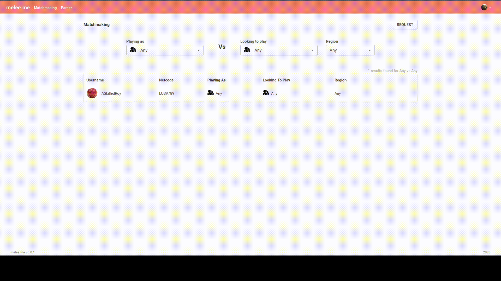
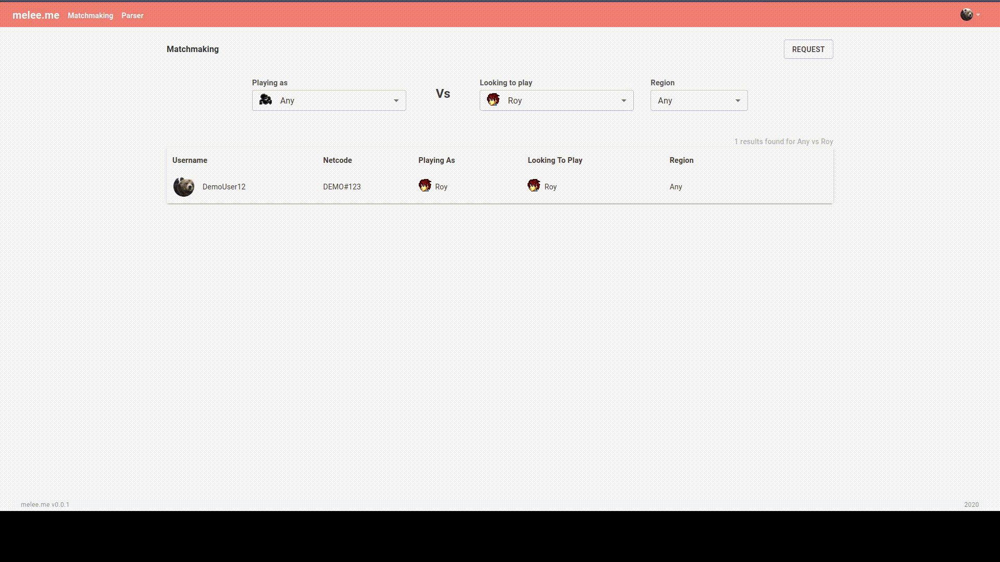

# melee.me
A website for finding people to play Super Smash Bros. Melee with on Slippi.
Check out the live version of the site [here](https://meleeme.net) (Temporarily shutdown)

# About
melee.me is a full stack app made with Nodejs and a React frontend. 
It includes the ability to create accounts / profiles, a live updating list of current match requests and an real-time chat.






# Features
Live match request feed searchable by character and region to find desired matchup.
Chat for negotiations between matched players.
Parser page for quick and easy access to game stats. Leverages the @slippi/slippi-js parser.

# How to build?
## To build backend server:
```shell
git clone https://github.com/cavisd7/MeleeMe
cd MeleeMe/backend/
npm install
```

## Run with Docker-Compose
Exposes port 4000.

In MeleeMe/backend/ run:
```shell
npm run dev:docker:start
```

## Run locally (without Docker)
### Setup environment
You will need a version of postgresql and redis running on your machine. If you do not have redis or postgres installed see above to run with Docker-Compose.
A .env.local file is needed to run the server. This is where you will provide redis and postgresql connection information as well as other server configuration. 

Runs on port 4000 by default.

In MeleeMe/backend/ run:
```shell
npm run dev:local
```

## To build frontend:
```shell
cd ../frontend/
npm install
```

## Run with Docker-Compose
Exposes port 3000. 

In MeleeMe/frontend/ run:
```shell
npm run dev:docker:start
```

## Run locally (without Docker)
Runs on port 3000 by default.

Start webpack dev server:
```shell
npm run dev:start
```